# CompChemKit user guide

CompChemKit is a set of small apps for everyday work in computational chemistry and molecular modelling: a lab notebook, a literature hub, an HPC workbench, a structure studio with a QM/MM region builder, and a paper kit, tied together by a control center. It runs as an Android app or in any browser, works offline apart from the online lookups, and keeps your data on your own device. There is no account and no tracking.

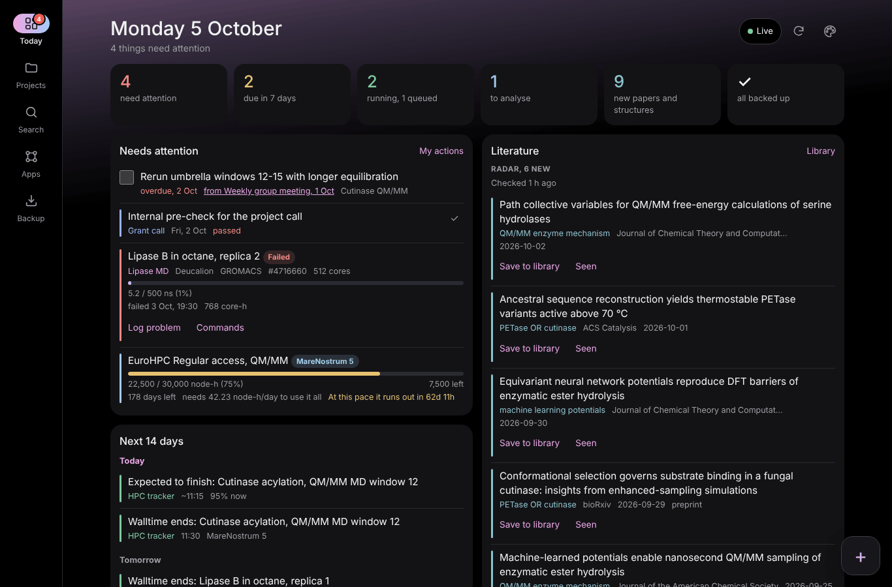

> The screenshots use made-up example data for a fictional researcher. The papers in the library are real publications; the people, calculations, radar results, citation profile and journal figures are invented or illustrative.

## Getting started

**Android (8.0 or newer).** Download `compchemkit-X.Y.Z.apk` from the *Releases* page, open it and allow the install when Android asks. You get six icons, CompChemKit (the control center) and one per suite, all sharing the same data. The app is signed by its author rather than distributed through the Play Store, so Android shows a warning; you install it at your own risk. To update, install the newer APK over the old one and your data stays.

**Computer.** Put the files in a folder, run `python serve_apps.py` (Python 3.8 or newer, no extra packages) and open `http://127.0.0.1:8765/control-center.html`. Keep using the same address and port, because the browser keeps the data of each address separately. The pages also work from a static host such as GitHub Pages, but without automatic backups.

In every suite the apps sit in a bar at the bottom of the screen (a rail on the left on wide screens), next to a **Backup** button. Most apps have a ⋮ menu with exports and *Export backup* / *Import backup*, and a + button to add something new.

## Control center

The place to start the day. **Today** shows what needs attention (passed deadlines, overdue action items, failed jobs, allocations running out early), an agenda for the next 14 days, running and queued calculations, and new papers and structures. **Projects** gathers everything linked to one project across all apps, **Search** looks through every app at once, **Apps** opens any suite at the right app, and **Backup** backs everything up or restores it.

The + button adds a log entry, idea, deadline, calculation, command or paper without opening the suite. Papers are looked up in Crossref by DOI or title words, and you pick the right one from the list of matches. Settings (the palette icon) holds the colour scheme, your name for *My actions*, and your OpenAlex key.

  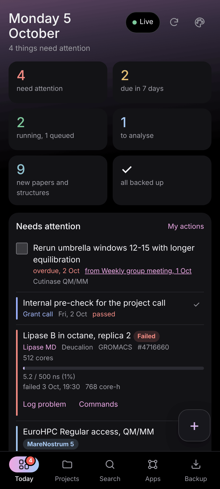
  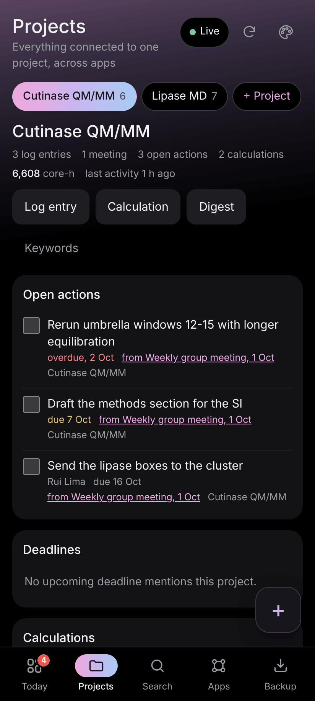
  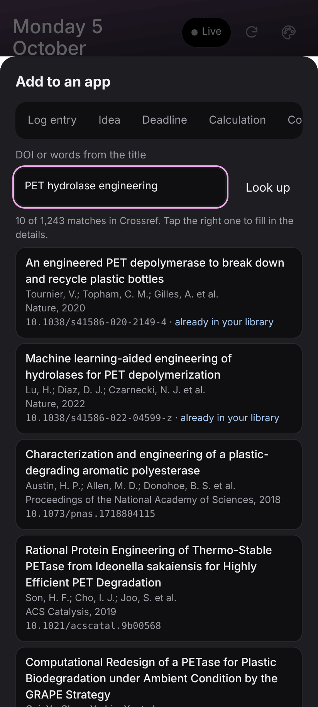

## Lab notebook

- **Research log**: dated entries (notes, results, problems, fixes, decisions) sorted by project, with `#tags`, pins and filters, plus meeting notes with people, decisions and action items. The Actions tab collects the open actions from every meeting, grouped by due date, and a follow-up meeting brings along whatever is still open.
- **Ideas**: a board with four stages (sparks, exploring, doing, done), categories, tags and favourites.
- **Script plans**: plan a Python or Bash script (inputs and outputs, command-line options, functions, steps and checks) and get a skeleton with a complete argument parser to start from.
- **Deadlines**: grant calls, abstracts, reports and teaching, with countdowns, yearly repeats and export to a calendar file.

  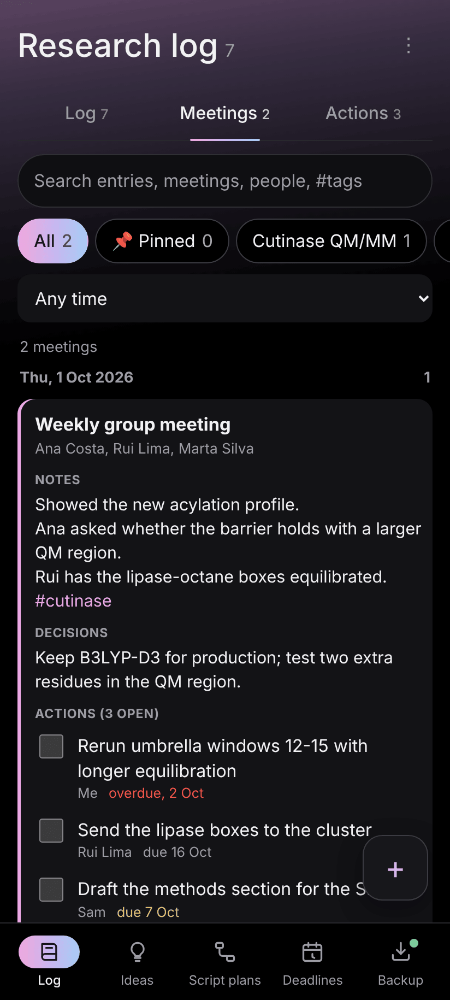
  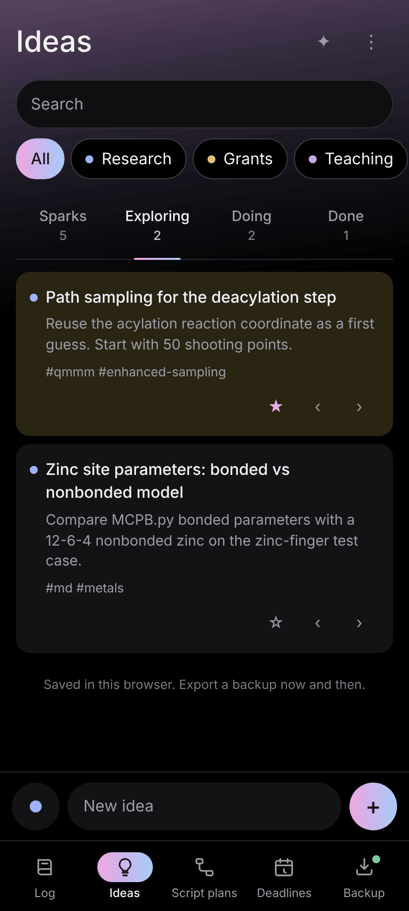
  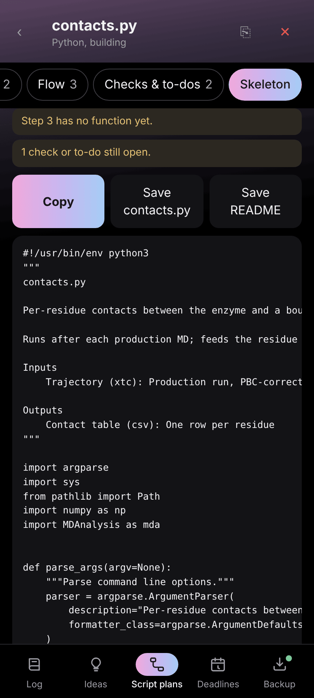

## Literature hub

- **Papers**: your library, with collections and stars. Add papers by DOI or by searching Crossref, copy DOIs and citations, and export BibTeX, RIS or CSV.
- **Radar**: follows topics such as `PETase OR cutinase` in OpenAlex and marks new papers until you have seen them, with filters for dates, paper types, open access and citations. One tap saves a paper to the library.
- **Citations**: your OpenAlex author profile, with citations, h-index, i10-index, yearly charts and the citations each work gained since the last check.

  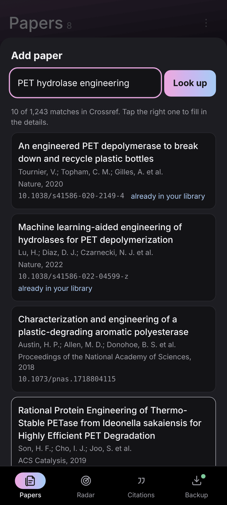
  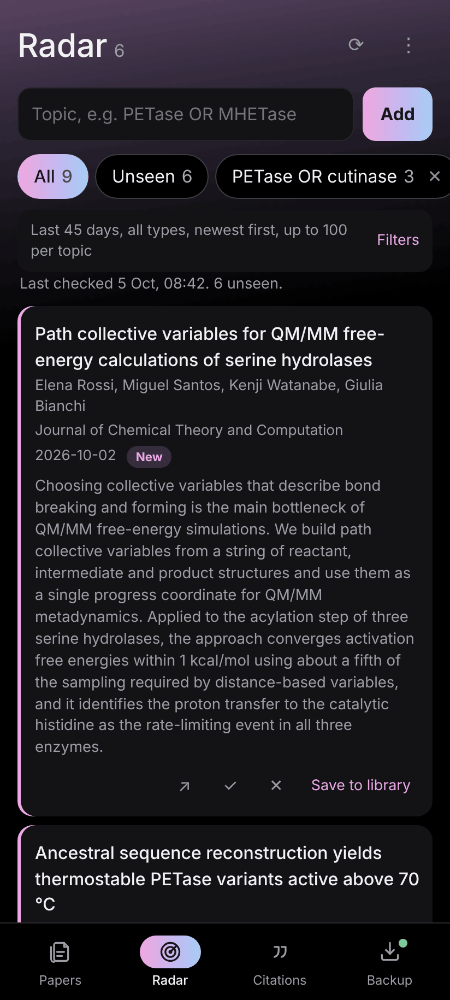
  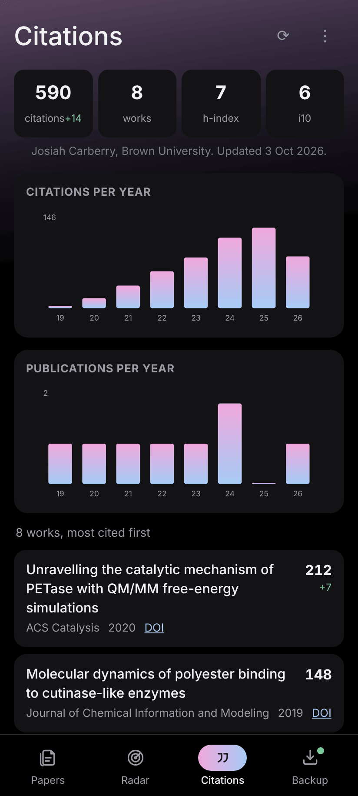

## HPC workbench

- **Tracker**: every calculation with its cluster, resources, walltime and progress. It estimates progress and finishing time from the rate, warns when a walltime runs out and counts core-hours. Allocations get a projection of how fast you are using them.
- **Job scripts**: SLURM or PBS scripts for Gaussian, ORCA, CP2K, GROMACS, AMBER or any command, with presets for your clusters and warnings about common mistakes.
- **Benchmarks**: ns/day for each setup, the cost per ns, the fastest and cheapest options, and the wall time and cost of the run you are planning.
- **Commands**: the commands you keep looking up, with blanks such as `{tpr}` that you fill in before copying; the last values are remembered.

  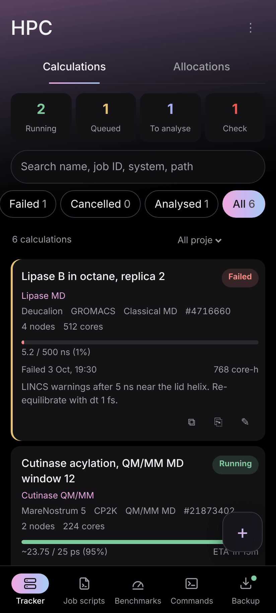
  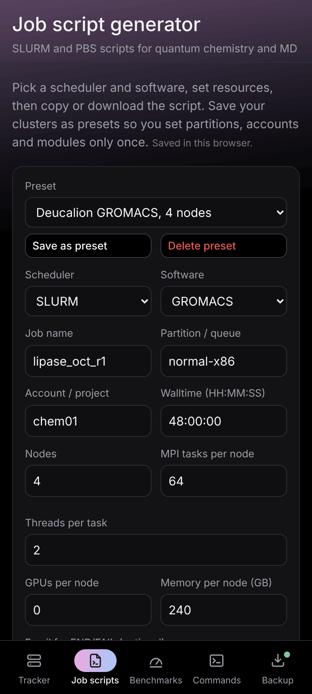
  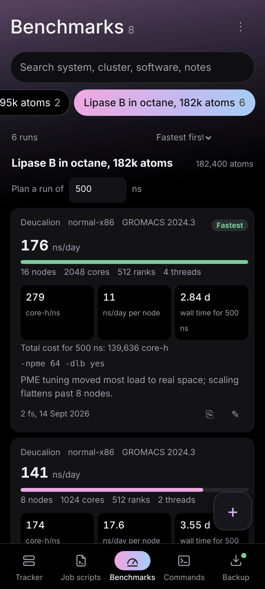

## Structure studio

- **Viewer**: a 3D viewer (3Dmol.js) for PDB, mmCIF, GRO, XYZ, SDF, MOL2 and PQR files. It opens PDB entries, AlphaFold models and PubChem compounds by ID, or searches all three by keyword. It has the usual styles and colourings, surfaces, ligand pockets, residue selections, distances and angles, trajectory frames and PNG snapshots.
- **QM/MM**: pick the QM region on a protonated structure by tapping or typing residues, choose where each residue is cut, and follow a running count of QM atoms, link atoms, charge, electrons and multiplicity, with every boundary checked. It writes Gaussian ONIOM input, a CP2K QM/MM section, Amber, VMD and GROMACS selections, and an XYZ file of the QM region.
- **Watcher**: saved searches (words, EC numbers, UniProt accessions or a sequence) that flag new structures in the PDB and new sequences in UniProt, ready to open in the viewer.

  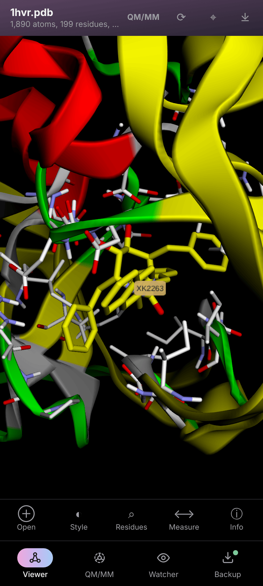
  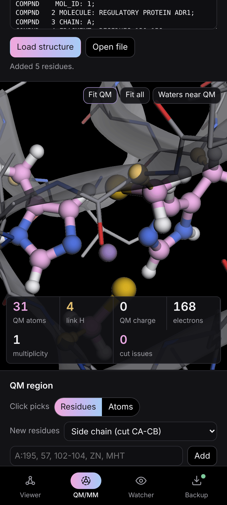
  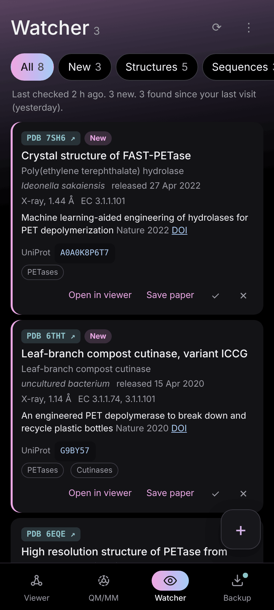

The viewer shows HIV-1 protease with its inhibitor (PDB 1HVR); the QM/MM example is the zinc site of a zinc finger (PDB 5A7U, with hydrogens added).

## Paper kit

- **Plot guide**: 31 chart types, each with a tested Python script that draws it from example data and saves a 600 dpi PNG.
- **Schemes**: an editor for reaction mechanisms with bonds, lone pairs, charges, curved arrows, reaction arrows and transition-state brackets, exported as SVG or 600 dpi PNG.
- **Journals**: 37 journals to filter by scope, citation impact (OpenAlex 2-year mean citedness, close to but not the same as the Impact Factor), open access cost and speed. You can edit the values and add your own journals.

  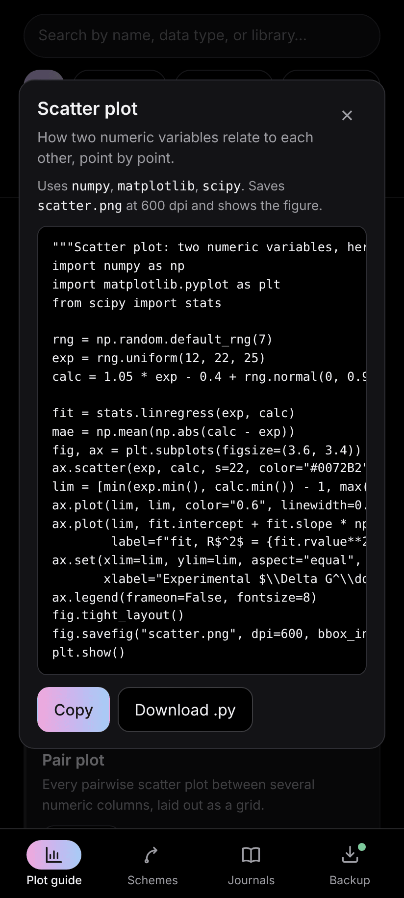
  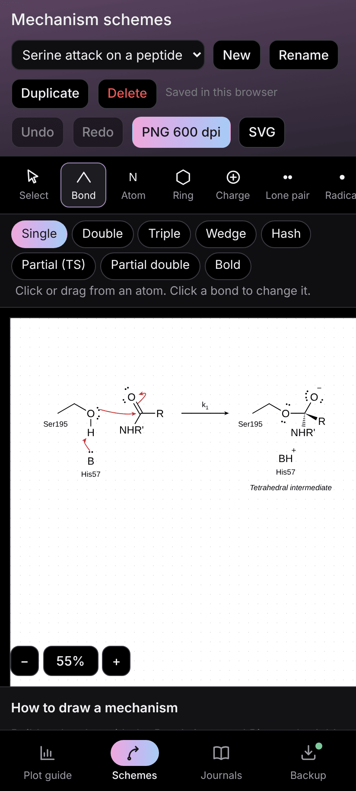
  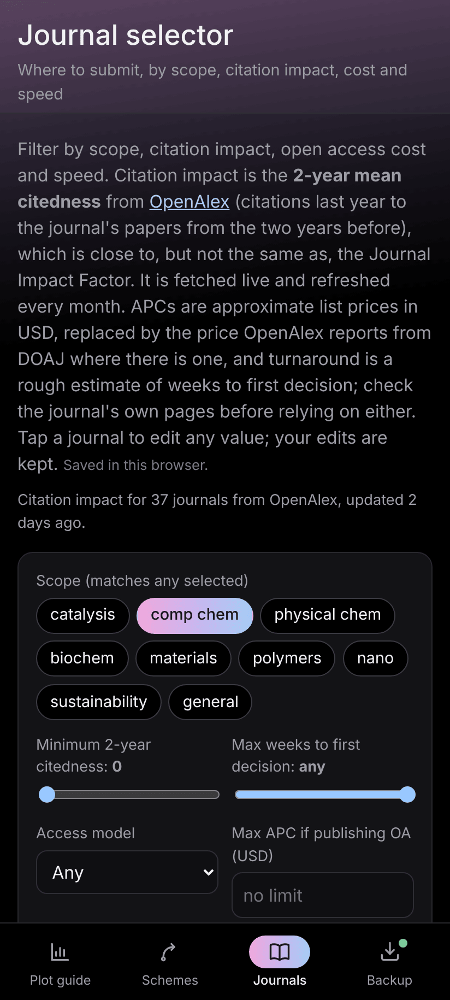

## Backups

Your data lives only on your device, so keep copies:

- The Android app backs up each app automatically to dated files and copies them to `Download/CompChemKit/backups/`, where they survive an uninstall. On a computer, `serve_apps.py` writes the same files once you switch automatic backups on.
- The **Backup** button in each suite shows the latest file for each app and restores any earlier one.
- **Download everything as one file**, in the control center's Backup view, saves all apps in a single file that restores on any device. Use it to move to a new phone or computer, and regularly when you use a hosted copy.

In a browser the data belongs to that browser and address, and browsers can clear it; Safari does so after about a week without a visit unless the suites are installed to the home screen.

## Colours

Settings offers dark, light or match device, in five palettes (Orchid, Ocean, Forest, Ember and Graphite). The choice applies at once to every suite and app.

  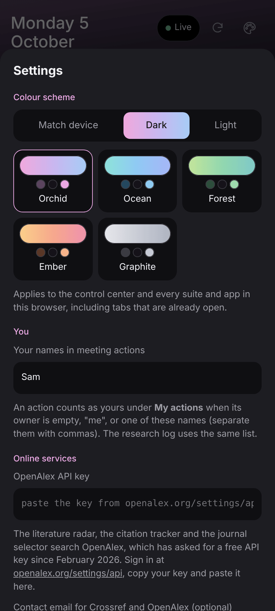
  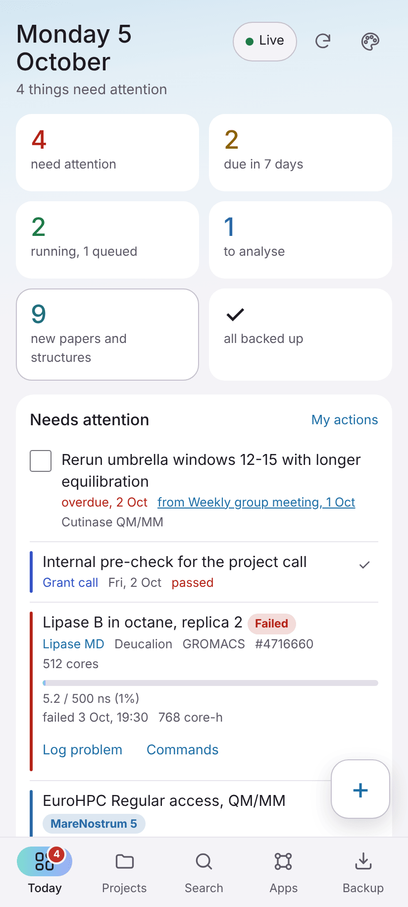

## Online services and privacy

Nothing leaves your device unless you use a lookup, and then the service receives only what the request needs. Papers come from Crossref; the radar, citations and journal figures from OpenAlex; structures from RCSB PDB, UniProt, AlphaFold DB and PubChem.

OpenAlex needs a free API key: sign in at [openalex.org/settings/api](https://openalex.org/settings/api), copy the key and paste it in the control center's Settings. It stays on your device and is never written into backup files.

For installation details, building the Android app and the scientific notes on the QM/MM builder and job scripts, see the [README](../README.md).
